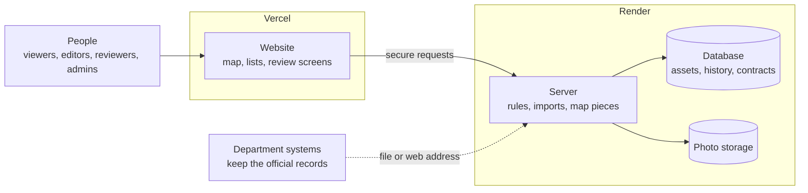
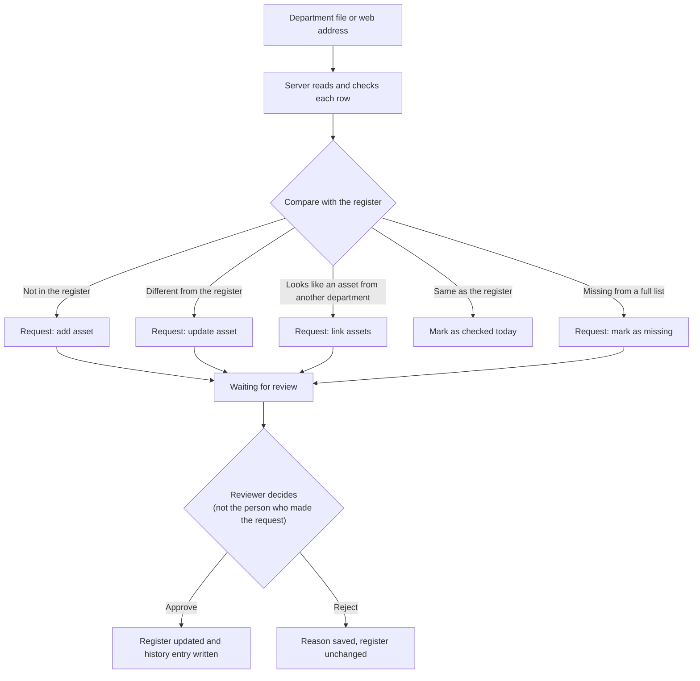

# Asset Register — Architecture

Plain-language architecture for the Pravi Labs "Build for Billions" hackathon.
Problem given: *build an end-to-end infrastructure asset inventory to track and manage assets across their entire lifecycle.*

Confidence tags: **[H]** high, **[M]** medium, **[L]** low. Tags are used on facts about the outside world and on judgment calls.

---

## 1. What we are building (in three sentences)

A website where people can see every public asset (roads, street lights, water pipes, schools and so on) on a map and in lists, with its area, stage, contracts, warranty, problems, photos and full history.
The departments' own systems stay the official source of the details. The register never edits their records.
Nothing enters or changes in the register until a second person approves it.

---

## 2. Settled decisions

| Topic | Decision |
|---|---|
| Asset types | Not fixed by Pravi. We use a built-in list of government physical asset types (section 3). Admins can edit it. |
| Life stages | No official list. Default stages are set in one place and admins can change them per asset type. |
| Approval | A person must approve every addition and change. The person who made the request cannot approve it. |
| Contracts and warranty | On. Contracts link to assets. A problem on an asset inside its warranty period is flagged for a warranty claim. |
| Who is official | Department systems stay official. The register keeps a read-only copy and adds its own information on top. |
| Offline use | Not needed. |
| Sign-in | Simple email and password. No state single sign-on. |
| Hosting | Website on Vercel. Server and database on Render. |
| Areas | A configurable tree (for example State > District > City > Ward). Admins set the level names. |
| Language | Plain words everywhere: screens, code names, documents, commit messages. |

---

## 3. What physical assets does government hold?

We centre the register on a fixed, limited catalog of **fixed physical assets** (things that stay in one place, or form a network).

**Where the catalog comes from**
- The five categories of the Government of India's Harmonised Master List of Infrastructure Sub-sectors: Transport and Logistics; Energy; Water and Sanitation; Communication; Social and Commercial Infrastructure. [H that the list has these five categories; the number of sub-sectors has been updated over time (sources quote 29, 34 and 38)]
- Everyday municipal asset lists. Ahmedabad Municipal Corporation's balance sheet lists land and buildings, roads and footpaths, bridges, culverts, street lights, fountains, urinals, dustbins, drains, water pipelines and water tanks, plus movable items such as furniture, computers and vehicles. [M-H]
- Our own grouping into 7 families and 37 types is a judgment call. [M] It has **not** been checked against Gujarat's own asset classification or Pravi's. [L] That is why admins can edit it.

**Out of scope for now:** movable items (vehicles, computers, furniture, machinery). The register is for things fixed to a place. [Decision, stated openly]

**The 7 families and 37 types**

| Family | Asset types |
|---|---|
| Roads and Bridges | Road, Bridge or Flyover, Culvert, Footpath or Cycle Track, Traffic Signal, Bus Shelter |
| Transport and Logistics | Transport Station or Terminal, Warehouse or Cold Store |
| Water and Sanitation | Water Pipeline, Water Treatment Plant, Water Tank, Pumping Station or Borewell, Sewer Line, Sewage Treatment Plant, Storm Water Drain, Irrigation Canal, Dam or Embankment, Solid Waste Facility, Public Toilet, Waste Collection Point |
| Energy and Street Lighting | Street Light, Substation or Transformer, Power Line, Solar Installation, Oil or Gas Pipeline |
| Communication | Telecom Tower, Communication Cable Route |
| Public Buildings and Social Facilities | Government Office Building, School or College, Hospital or Health Centre, Housing Complex, Sports Facility, Market or Shopping Complex, Community Hall or Centre |
| Public Spaces and Safety | Park or Garden, Fire Station, Burial Ground or Crematorium |

Each type has a usual drawing shape (point, line or area) and 3 to 7 short detail fields. The full list is in `04_extras.md`, ready to load as seed data.
Adding a new type or field is done in the Admin screen. It needs no new code. That is our scaling answer for "many kinds of assets".

---

## 4. The three parts

1. **Website (Vercel).** One React app with role-based screens.
2. **Server (Render).** One Python (FastAPI) app. It holds all the rules, reads department files, and sends map pieces (small chunks of map data) to the website.
3. **Database (Render Postgres with the PostGIS map extension).** One database holds everything, so there is one place to back up and one place to trust.

Photos go to storage behind a two-option setting: inside the database (fine for the demo) or an S3-compatible bucket (for real use). [M]

Why so few parts: every extra service is another thing to run, secure and explain. Growth steps that need more parts are listed in section 9, each with a trigger.

---

## 5. How data gets in (department systems stay official)

**Who owns what**

| Information | Owner | Can the register change it? |
|---|---|---|
| Name, type, location, stage, details as given by the department | The department system | No. Shown as read-only, labelled "Official record kept by [department system], last checked [date]". The register only takes in newer versions, after approval. |
| Register code, area, links between departments' records | The register | Yes, after approval |
| Contracts, warranty, problems, photos, notes, history | The register | Yes, after approval where it changes the register (see section 6) |

If a reviewer finds a mistake in an official record, they leave a **correction note** for the department. The register never overwrites it.

**Ways to bring data in (version 1)**
- Upload a file: CSV (with latitude and longitude columns, or a shape column in WKT text), or GeoJSON. Zipped Shapefile is a second priority and only if it is in latitude/longitude (WGS84). [M, based on common formats; not confirmed with Pravi]
- Fetch from a web address that returns one of those formats.
- Each department system saves its own column mapping so the second upload is one click.

**Same asset in two departments' lists**
The server suggests a match: same asset type, close together (default 25 metres), and a similar name when both have one. A person always decides. If they say "same asset", the register keeps one entry with two department records attached.

---

## 6. What needs a person's approval

| Change | Made by | Approved by |
|---|---|---|
| Add asset, update asset, link assets, mark as missing (from imports) | Editor (by importing) | Reviewer or admin |
| Add or change a contract and the assets it covers | Editor | Reviewer or admin |
| Warranty claim to a contractor | Created automatically when a problem is reported inside a warranty period | Reviewer or admin decides the cause |

Rules
- The person who made a request cannot approve it. (Setting "second person must approve", on by default.)
- Everything approved or rejected is saved with who, when and why.
- Not needing approval: reporting a problem, adding a photo, adding a note. These are records about the asset, not changes to the register's official content. They still appear in the history.

---

## 7. Warranty (defect liability period)

Road and building contracts often include a warranty period after completion in which the contractor must fix defects. [H that this exists in public works contracts; M on how common leakage is]
The warranty length is stored per contract (never fixed at 36 months).

1. Someone reports a problem on an asset.
2. The server checks the asset's linked contracts: is today between the completion date and the end of the warranty?
3. If yes, it creates a **warranty claim request** and shows a "Under warranty" badge.
4. A reviewer sees the contract, contractor, days left and the problem, then picks the cause: bad workmanship, damage by someone else, normal wear, or not sure.
5. Bad workmanship: the claim is approved, a printable claim letter is created, and the asset gets a "Repair budget on hold" flag until the claim is closed.
6. Any other cause: the request is rejected with the cause saved. Normal repair goes ahead.

The register **suggests**. A person decides. It never sends a claim on its own.

---

## 8. Map, areas and access

**Map.** The server builds small map pieces straight from the database for the part of the map on screen.
- Zoomed out: grouped dots with a count.
- Zoomed in: real shapes, coloured by stage.
- Pieces carry only the ID, type, stage and two flags (open problem, under warranty). Full details are fetched when someone clicks, and are checked against the person's access.
The base map uses OpenStreetMap tiles for the demo. Replace with a proper provider before real use, following the OpenStreetMap tile usage policy. [M]

**Areas.** Each asset belongs to one area. Each user is limited to one area and everything below it (or all areas). Every list, map piece, report, photo and search applies this limit.

**Roles**

| Role | Can do |
|---|---|
| Viewer | Look at everything in their area |
| Editor | Viewer + import data, propose contracts, report problems, add photos and notes |
| Reviewer | Viewer + approve or reject requests, add notes |
| Admin | Everything, plus users, areas, asset types and stages, department systems, settings |

---

## 9. Growth plan (how it scales, and when we would add parts)

What makes it scale without new code: a new department is one saved setup; a new asset type is one form; a new area is one tree entry. Data volume grows by rows, not by structure.

| Step | When to do it (measured, not guessed) |
|---|---|
| Add database indexes and pre-count dashboard numbers | Already in the design |
| Pre-build the zoomed-out map dots into a table after each import | Map pieces at low zoom take longer than the target in the load test |
| Split the biggest tables (assets, history) by area | The database is too big for one machine's comfortable size, per load test |
| Add a read-only copy of the database for reports | Reports slow down editing |
| Move map pieces to their own small service with a short cache in front | Map traffic is the main load |
| Move file imports to their own worker | Imports slow the website for other people |

Target for the load test (set by the builder, then reported honestly): map-piece and list response times on a synthetic data set of at least 200,000 assets, with a stretch run of 2 million on a local machine.
We say "designed for" until we have run it, and then "tested with N assets, median response X ms".

---

## 10. Not in version 1 (said openly)

Writing corrections back into department systems; live two-way sync; offline mobile capture; state single sign-on; a public complaint form; a mobile app; movable assets; automatic matching without a person; automated tests against real Pravi data.

---

## 11. Hosting facts (checked on 28 Sep 2026 via search)

- Render Postgres supports PostGIS on Postgres 13 and later, including free databases. [H]
- Free Render databases expire 30 days after creation. [H] Free Render web services sleep after about 15 minutes idle, and the first request afterwards can take up to about a minute. [H]
- So for judging: use a paid plan for the database and server, or wake the server before the demo. The website pings the server's health address on load to help. Check Render's current plan names and prices before choosing. [M]
- Vercel hosts only the website. The server stays on Render because it needs a long-running Python process and a database connection pool. [M-H]

---

## 12. What we can say, and what we cannot

Can say (each is true by design and has a test):
- Nothing enters or changes in the register without a second person's approval.
- Department systems stay the official source. The register does not edit their records.
- History entries cannot be edited or deleted (the database blocks it).
- Adding a new asset type, department or area needs no new code.
- Access is limited by area on every screen.

Say only after the load test: "Tested with N assets; median map response X ms."

Do not say: "handles billions", "instant", "fraud-proof", "audit-approved", "photo proves location", "works offline".
