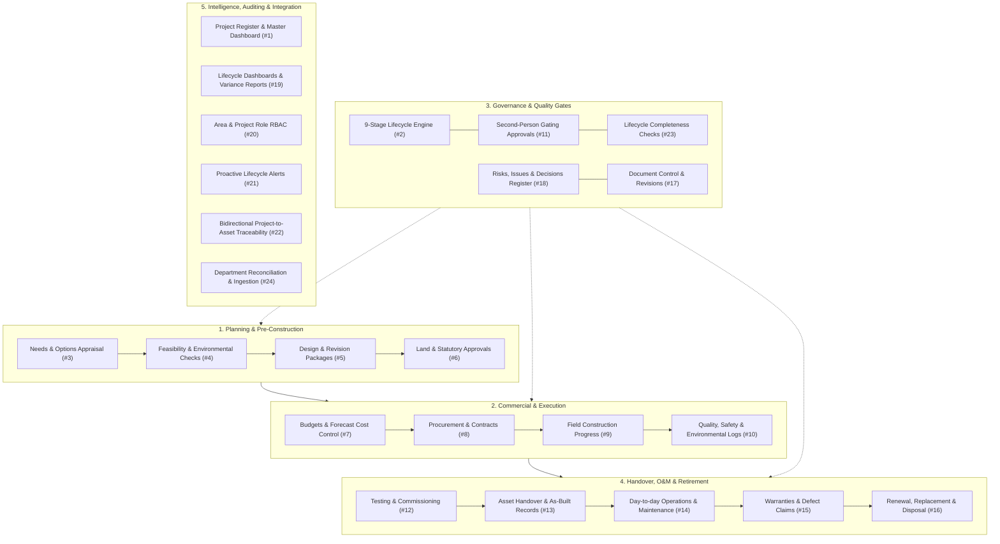

# Asset Register v2: Infrastructure Project Lifecycle & Asset Management

## Executive Summary
This document provides the full architectural blueprint and implementation plan for **v2 of the Asset Register**. 

In v1, the application focused on an inventory of assets imported from departmental sources, problem reporting, contracts, and review queues.
**v2 expands the platform into a complete Infrastructure Lifecycle Management System**, tracking capital projects from initial need identification through feasibility, design, approvals, procurement, construction, commissioning, handover, operations & maintenance, and eventual renewal or disposal, while establishing direct **Admin Asset CRUD** capabilities and preserving second-person approval integrity.

---

## 1. Domain Architecture & 24 Requirements Mapping

The 24 lifecycle requirements are organized into **6 core functional engines**:



---

## 2. Immediate Priority: Admin Asset CRUD & Navigation

### Current Pain Point
In v1, assets can only be added or modified via department file uploads (`/imports`) and reviewer approval batches (`/change-requests`). There is no direct mechanism for an Administrator to:
1. Manually add an asset directly from the portal.
2. Edit an asset's name, stage, area, type, details, or location.
3. Soft-delete / deactivate or retire an asset.
4. Navigate and manage assets easily within the Admin panel.

### Solution Design
1. **API Endpoints (`/assets`)**:
   - `POST /assets`: Admin direct creation with automatic `register_code` generation (`AR-XXXXXXX`), geometry parsing (GeoJSON / WKT), stage validation, and history logging.
   - `PATCH /assets/{asset_id}`: Admin direct update for asset metadata, details JSONB, area, and stage, capturing before/after values into `history_entry`.
   - `DELETE /assets/{asset_id}`: Admin deactivation (`is_active = false`), triggering automatic map-count decrements and audit trail.
2. **Admin UI Navigation**:
   - New **"Assets" tab** in the Admin panel (`/admin`) displaying search, filters, direct "Create Asset" modal, and row-level "Edit" / "Deactivate" actions.
   - On the main **Asset Detail page** (`/assets/:id`) and **Asset List** (`/assets`), adding inline **Edit** and **Delete** actions visible exclusively to users with the `admin` role.

---

## 3. Database Schema Extensions (v2)

### Table: `project` (Requirement 1 & 2)
```sql
CREATE TABLE project (
  id uuid PRIMARY KEY DEFAULT gen_random_uuid(),
  code text UNIQUE NOT NULL,                  -- 'PRJ-0000101'
  name text NOT NULL,
  project_type text NOT NULL,                -- 'Road widening', 'Water pipeline', etc.
  department_system_id int REFERENCES department_system(id),
  owner_user_id int REFERENCES app_user(id),
  area_id int NOT NULL REFERENCES area(id),
  current_stage_key text NOT NULL DEFAULT 'need_identified',
  status text NOT NULL DEFAULT 'active',     -- 'active', 'on_hold', 'completed', 'cancelled'
  approved_budget numeric(14,2) DEFAULT 0,
  forecast_cost numeric(14,2) DEFAULT 0,
  actual_cost numeric(14,2) DEFAULT 0,
  target_start_date date,
  target_completion_date date,
  location geometry(Geometry, 4326),
  description text,
  details jsonb NOT NULL DEFAULT '{}',
  created_at timestamptz NOT NULL DEFAULT now(),
  updated_at timestamptz NOT NULL DEFAULT now()
);
```

### Table: `project_stage_history` (Requirement 2 & 11)
```sql
CREATE TABLE project_stage_history (
  id bigserial PRIMARY KEY,
  project_id uuid NOT NULL REFERENCES project(id),
  from_stage text,
  to_stage text NOT NULL,
  decision text NOT NULL,                    -- 'advanced', 'held', 'rejected'
  who_user_id int NOT NULL REFERENCES app_user(id),
  reviewer_user_id int REFERENCES app_user(id),
  comments text,
  evidence_url text,
  happened_at timestamptz NOT NULL DEFAULT now()
);
```

### Table: `project_asset` (Requirement 1, 13, 22)
```sql
CREATE TABLE project_asset (
  project_id uuid NOT NULL REFERENCES project(id),
  asset_id uuid NOT NULL REFERENCES asset(id),
  relation_kind text NOT NULL DEFAULT 'creates', -- 'creates', 'modifies', 'retires'
  linked_at timestamptz NOT NULL DEFAULT now(),
  PRIMARY KEY (project_id, asset_id)
);
```

### Table: `project_item` (Requirements 3, 4, 5, 6, 9, 10, 18)
Polymorphic project lifecycle log for items, risks, permits, milestones, and design packages:
```sql
CREATE TABLE project_item (
  id uuid PRIMARY KEY DEFAULT gen_random_uuid(),
  project_id uuid NOT NULL REFERENCES project(id),
  item_type text NOT NULL,                   -- 'need', 'feasibility', 'design', 'permit', 'milestone', 'risk', 'quality', 'safety'
  title text NOT NULL,
  status text NOT NULL DEFAULT 'open',       -- 'open', 'approved', 'mitigated', 'closed', 'expired'
  severity text,                             -- 'low', 'medium', 'high', 'critical'
  due_date date,
  owner_user_id int REFERENCES app_user(id),
  data jsonb NOT NULL DEFAULT '{}',
  created_at timestamptz NOT NULL DEFAULT now(),
  updated_at timestamptz NOT NULL DEFAULT now()
);
```

---

## 4. Implementation Phases

| Phase | Scope | Deliverables |
|---|---|---|
| **Phase 1 (Immediate)** | **Admin Asset CRUD & Projects Foundation** | • Backend `POST /assets`, `PATCH /assets/{id}`, `DELETE /assets/{id}`<br>• Admin UI Assets Tab & Asset Detail Edit/Delete buttons<br>• Migration `0004_projects.sql` with Project Register, Stages, & Asset Links<br>• Backend `server/app/projects.py`<br>• Frontend Projects List & Detail page |
| **Phase 2** | **Planning, Feasibility & Approvals (Reqs 3–6)** | • Needs & Options register<br>• Feasibility & environmental checklists<br>• Statutory permits & land acquisition tracker with expiry alerts |
| **Phase 3** | **Budget, Procurement & Construction (Reqs 7–10)** | • Budget commitments vs actual cost tracker<br>• Tender & procurement package linking<br>• Field milestones, progress tracking, safety/quality log |
| **Phase 4** | **Testing, Commissioning & Handover (Reqs 12–13)** | • Commissioning checklists & defects signoff<br>• Automatic Asset Handover wizard creating/updating live assets from project delivery |
| **Phase 5** | **Operations, Maintenance & Renewal (Reqs 14–16)** | • Work orders & preventative maintenance schedules<br>• Asset condition monitoring & renewal/replacement forecasting |
| **Phase 6** | **Lifecycle Dashboards, RBAC & Alerts (Reqs 17–24)** | • Complete pipeline dashboards & budget variance reports<br>• Expiry alerts (permits, warranties, milestones)<br>• Department reconciliation & import comparison |
